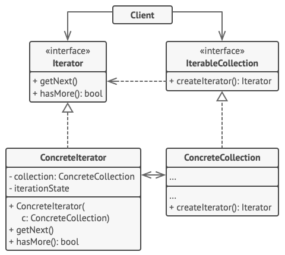
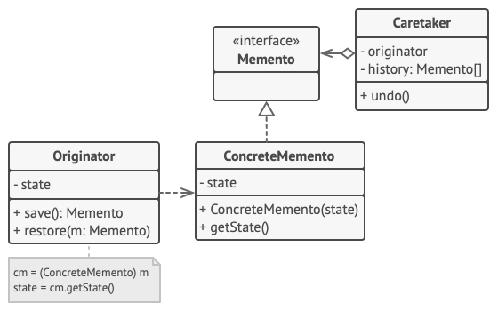

# Патерни

**_Патерни проектування_** описують типові способи вирішення поширенихпроблем при проектуванні програм.

**_Породжуючі_** патерни піклуються про гнучке створення об’єктів без внесення в програму зайвих залежностей.

**_Структурні_** патерни показують різні способи побудови зв’язків між об’єктами.

**_Поведінкові_** патерни піклуються про ефективну комунікацію між об’єктами.

## Поведінкові патерни

### Command

**_Команда_** — це поведінковий патерн проектування, який перетворює запити на об’єкти, дозволяючи передавати їх як аргументи під час виклику методів, ставити запити в чергу, логувати їх, а також підтримувати скасування операцій.

### Iterator

**_Ітератор_** — це поведінковий патерн проектування, що дає змогу послідовно обходити елементи складових об’єктів, не розкриваючи їхньої внутрішньої організації.

### Memento

**_Знімок_** — це поведінковий патерн проектування, що дає змогу зберігати та відновлювати минулий стан об’єктів, не розкриваючи подробиць їхньої реалізації.

### Observer

**_Спостерігач_** — це поведінковий патерн проектування, який створює механізм підписки, що дає змогу одним об’єктам стежити й реагувати на події, які відбуваються в інших об’єктах.

### Strategy

**_Стратегія_** — це поведінковий патерн проектування, який визначає сімейство схожих алгоритмів і розміщує кожен з них у власному класі. Після цього алгоритми можна заміняти один на інший прямо під час виконання програми.

### Template method

**_Шаблонний метод_** — це поведінковий патерн проектування, який визначає кістяк алгоритму, перекладаючи відповідальність за деякі його кроки на підкласи. Патерн дозволяє підкласам перевизначати кроки алгоритму, не змінюючи його загальної структури.

### Visitor

**_Відвідувач_** — це поведінковий патерн проектування, що дає змогу додавати до програми нові операції, не змінюючи класи об’єктів, над якими ці операції можуть виконуватися.

